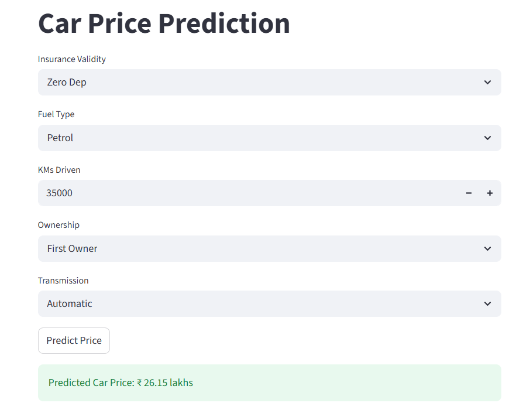

# Car Resale Price Prediction using Machine Learning

##  Project Overview
This project predicts the resale price of a car using Machine Learning techniques.  
It also includes a simple web application built using Streamlit for real-time predictions.

---

##  Features
- Data preprocessing and cleaning
- Model training using regression techniques
- Model saving using Pickle
- Interactive UI using Streamlit
- Real-time car price prediction

---

##  Tech Stack
- Python
- Pandas
- NumPy
- Scikit-learn
- Streamlit
- Pickle

---

##  Project Structure
## 📂 Project Structure

```
Car-Resale-Price-Prediction/
│
├── app.py
├── final_model.pkl
├── requirements.txt
├── README.md
│
├── data/
│   └── car_dataset_processed.csv
│
├── notebooks/
│   └── model_training.ipynb
```

---

##  How to Run the Project

### Step 1: Install dependencies
pip install -r requirements.txt

### Step 2: Run the Streamlit app
streamlit run app.py

---

##  Output
Enter car details like:
- Insurance Validity
- Fuel type
- KMs Driven
- Ownership
- Transmission

 The model predicts the resale price instantly

 

---

##  Key Learning
- End-to-end ML pipeline (data → model → deployment)
- Model serialization using Pickle
- Building ML apps using Streamlit

---

##  Future Improvements
- Improve model accuracy  
- Add more features  
- Deploy app online (Streamlit Cloud)

---

##  Acknowledgment
This project was developed as part of a hands-on guest lecture on AI/ML and Data Science.